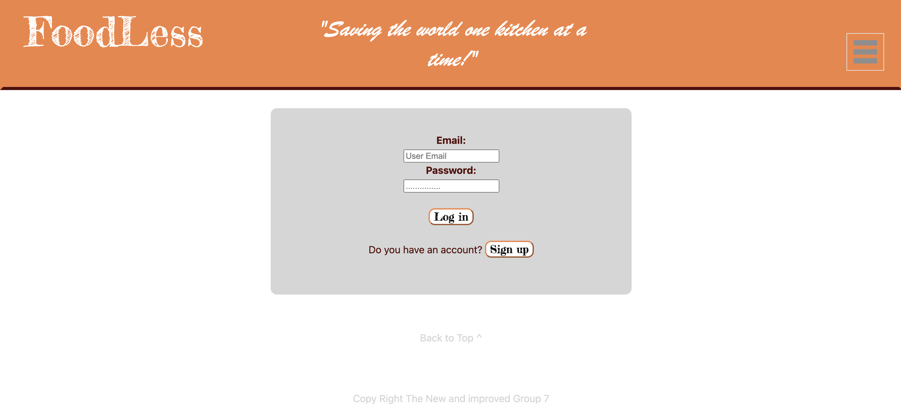
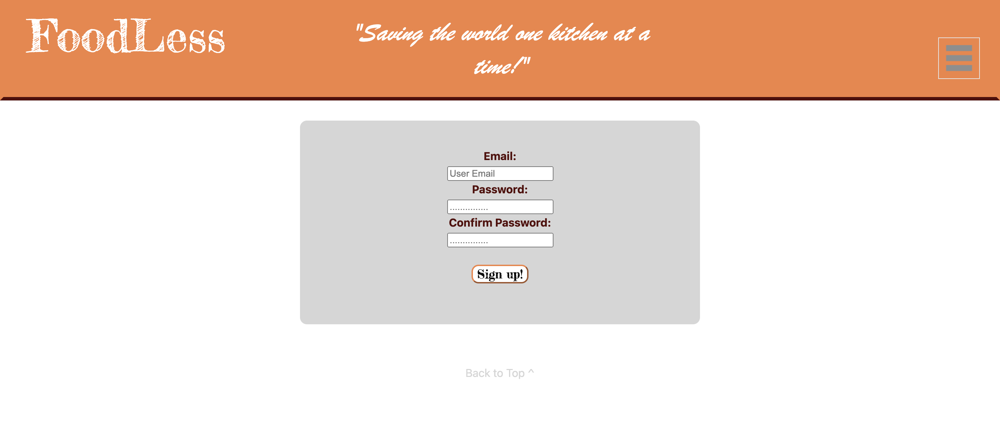
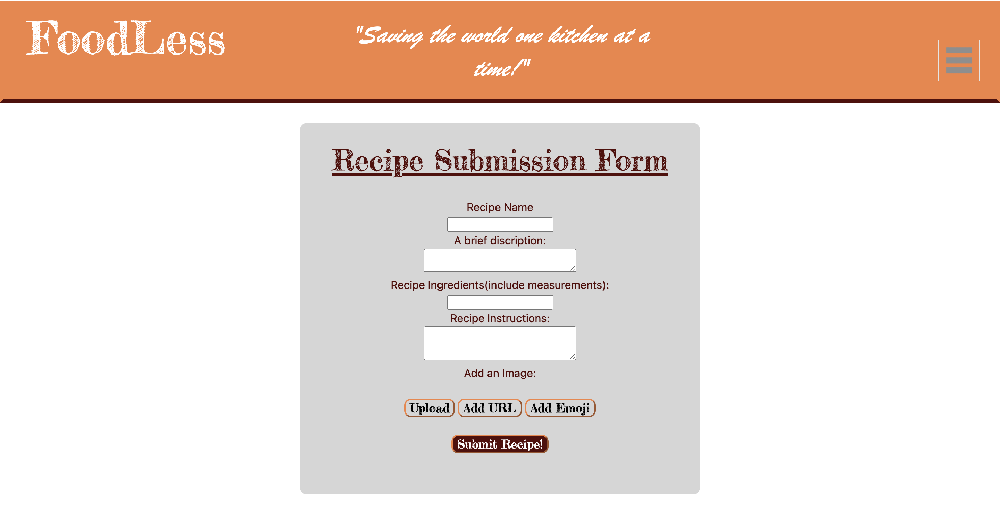
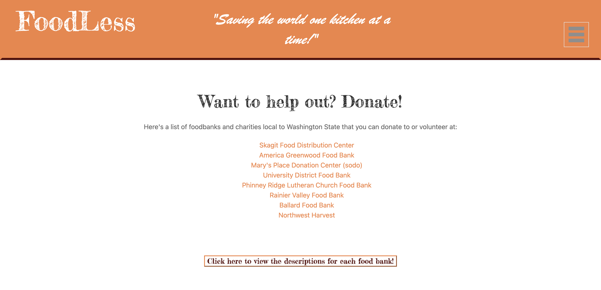

### Name of the Project: ###
FoodLess

### Description: ###
Our website is a recipe search tool that allows the user to find recipes with ingredients the user already possesses in their pantry or refrigerator. The user will be able to enter one or multiple ingredients into the search bar simultaneously and obtain search results from various sources across the web with recipes containing the aforementioned ingredients. The user is able to login and save recipes to their account. 

### Motivation: ###
Aim of the project is to give users best possible recipes based on the ingredients available in their kitchen which will eventually reduce food wastage.

### Technologies used: ###
   * HTML
   * CSS
   * Visual Studio Code Editor
   * Javascript
   * SQL
   * Node
   * Express
   * Sequalise
   * Heroku

### Website Screen Shots: ###

Live Deployed link:
https://hidden-wave-52088.herokuapp.com/
https://github.com/pjkingsley/Project2PracticeRepo/edit/main/README.md

